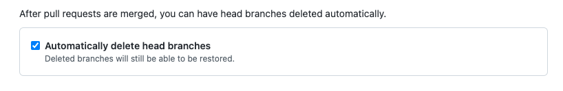

# Branch Cleanup Action

[](https://travis-ci.org/jessfraz/branch-cleanup-action)

A GitHub action to automatically delete the branch after a pull request has been merged. Here's [a blog post](https://blog.jessfraz.com/post/the-life-of-a-github-action/) describing this action in more detail.

> **NOTE:** This will **never** delete the repository's default branch or protected branches. If the pull request is closed _without_ merging, it will **not** delete it.

**Table of Contents**

<!-- toc -->

- [Usage](#usage)
- [Contributing](#contributing)
  * [Running the tests](#running-the-tests)
- [Succession](#succession)

<!-- tocstop -->

## Usage

```
workflow "on pull request merge, delete the branch" {
  on = "pull_request"
  resolves = ["branch cleanup"]
}

action "branch cleanup" {
  uses = "jessfraz/branch-cleanup-action@master"
  secrets = ["GITHUB_TOKEN"]
}
```

If you include this in another Workflow, you may want to configure the environment variable `NO_BRANCH_DELETED_EXIT_CODE`. The default value for this is `78`, as Github Actions will mark a check as "neutral" (neither failed/succeeded) when you exit with code 78. This will however **cancel** any other actions running in parallel in this workflow.

If you don't want it to cancel, configure your workflow as follows:

```
action "branch cleanup" {
  uses = "jessfraz/branch-cleanup-action@master"
  secrets = ["GITHUB_TOKEN"]

  env = {
    NO_BRANCH_DELETED_EXIT_CODE = "0"
  }
}
```


## Contributing

### Running the tests

The tests use [shellcheck](https://github.com/koalaman/shellcheck). You don't need to install anything (assuming you have [docker](https://www.docker.com) installed). The tests run in a container.

```console
$ make test
```

## Succession
As there is now a [feature to delete branches automatically](https://docs.github.com/en/repositories/configuring-branches-and-merges-in-your-repository/configuring-pull-request-merges/managing-the-automatic-deletion-of-branches) after a merged PR this action might not be needed in all cases. Check if you still need this action for any reason of if the repository configuration solves your use case. 

**Settings > General > Pull Requests > Automatically delete head branches**



