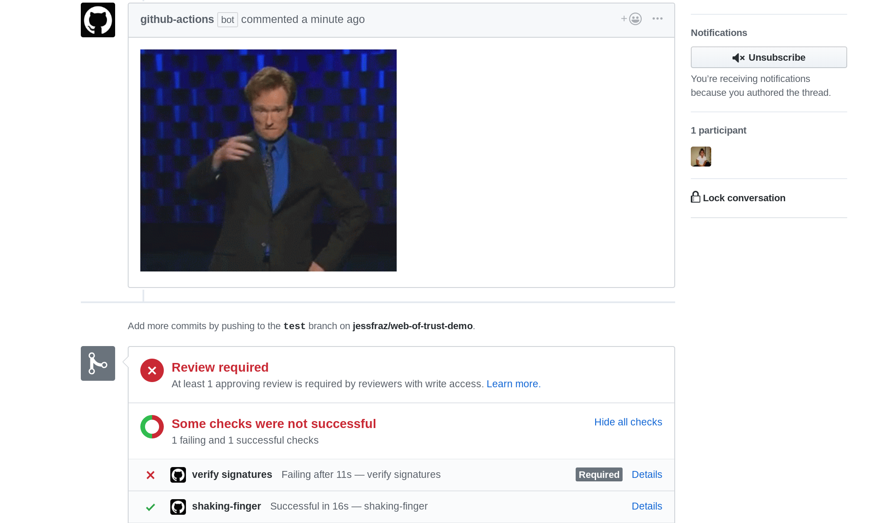

# Branch Cleanup Action

[](https://travis-ci.org/jessfraz/branch-cleanup-action)

A GitHub action to automatically delete the branch after a pull request has been merged. 

> **NOTE:** This will **never** delete a branch named "master". If the pull request is closed _without_ merging, it will **not** delete it.


```
workflow "on pull request merge, delete the branch" {
  on = "pull_request"
  resolves = ["branch cleanup"]
}

action "branch cleanup" {
  uses = "jessfraz/branch-cleanup-action@master"
  secrets = ["GITHUB_TOKEN"]
}
```



### Tests

The tests use [shellcheck](https://github.com/koalaman/shellcheck). You don't
need to install anything. They run in a container.

```console
$ make test
```
